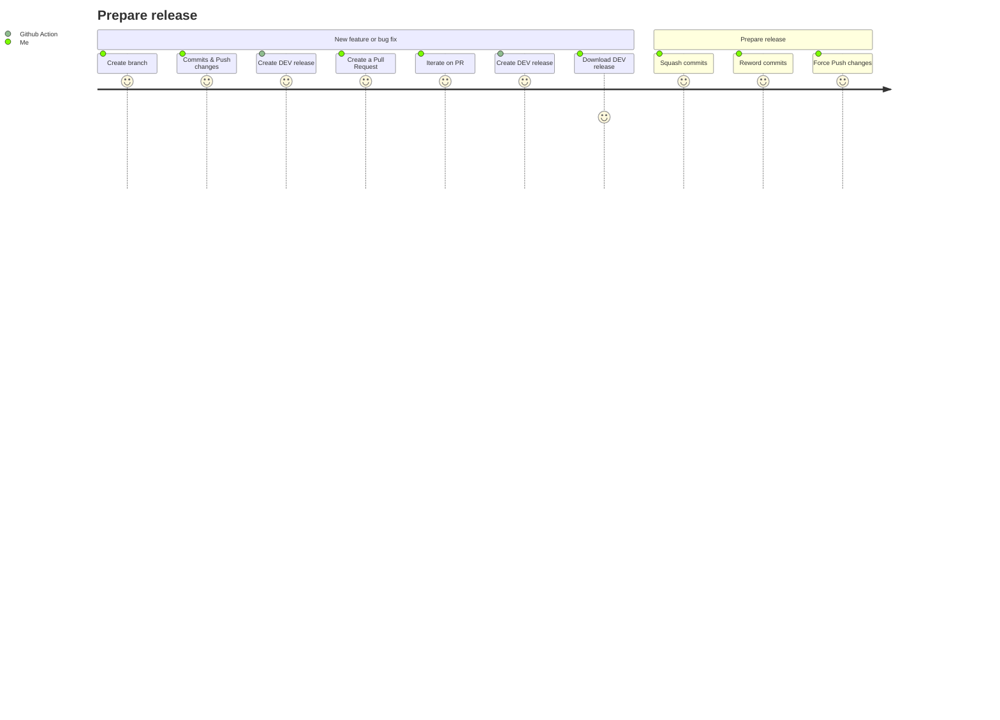
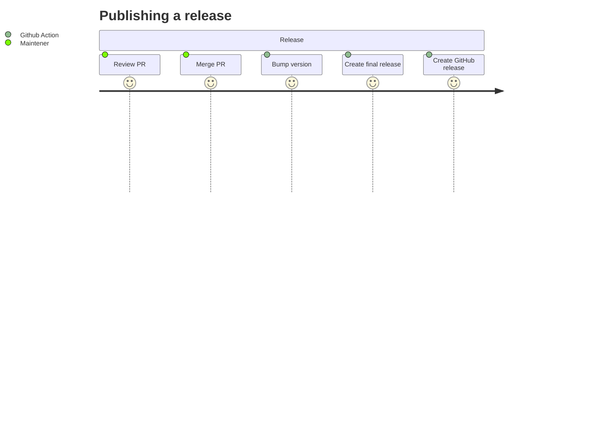
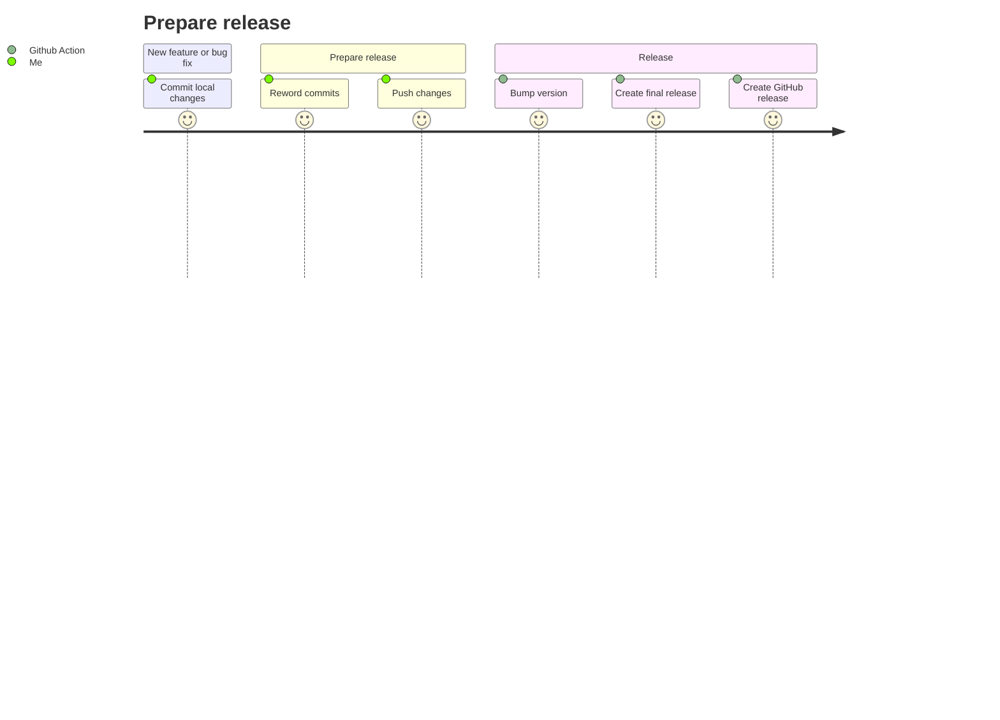

# Contributing 

## Principles

### Releasing based on Pull Request

* step 1

* step 2

#### Downloading dev release
Dev release are available as GitHub artefacts on each builds of create-dev-release-on-PR (on-PRs-commits.yml)

### Releasing based on `master` direct commits

#### Reword commits
We use [conventional commits convention](https://www.conventionalcommits.org/en/v1.0.0/)

> The commit contains the following structural elements, to communicate intent to the consumers of your library:
> 
>     fix: a commit of the type fix patches a bug in your codebase (this correlates with PATCH in Semantic Versioning).
>     feat: a commit of the type feat introduces a new feature to the codebase (this correlates with MINOR in Semantic Versioning).
>     BREAKING CHANGE: a commit that has a footer BREAKING CHANGE:, or appends a ! after the type/scope, introduces a breaking API change (correlating with MAJOR in Semantic Versioning). A BREAKING CHANGE can be part of commits of any type.
>     types other than fix: and feat: are allowed, for example @commitlint/config-conventional (based on the Angular convention) recommends build:, chore:, ci:, docs:, style:, refactor:, perf:, test:, and others.
>     footers other than BREAKING CHANGE: <description> may be provided and follow a convention similar to git trailer format.
> 
> Additional types are not mandated by the Conventional Commits specification, and have no implicit effect in Semantic Versioning (unless they include a BREAKING CHANGE). A scope may be provided to a commit’s type, to provide additional contextual information and is contained within parenthesis, e.g., feat(parser): add ability to parse arrays.

> Examples

>   Commit message with description and breaking change footer
> 
>       feat: allow provided config object to extend other configs
> 
>       BREAKING CHANGE: `extends` key in config file is now used for extending other config files

>   Commit message with ! to draw attention to breaking change
> 
>       feat!: send an email to the customer when a product is shipped

Keyword use
- major: major or BREAKING CHANGES or ! after <type>
- minor: feat, feature
- patch: anything, because if we cannot determine the next version, we create a patch version by default.  

### auto release

Each commit on master branch generates a new release, except a few files described [here](.github/workflows/auto-release-on-master.yml)

